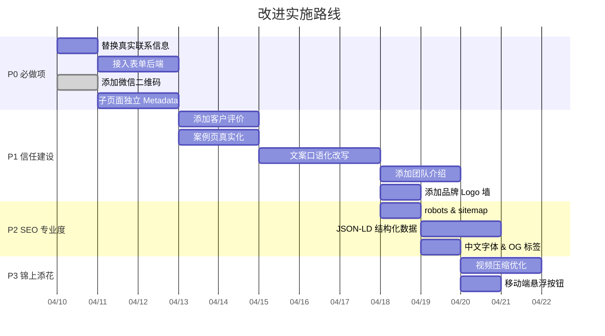

# 鑫龙堂舞狮网站 — 全维度代码审计报告

> **审计目标**：评估网站在「让受众产生信任感，并主动联系咨询演出」这个商业目标下的整体表现，给出分维度的差距分析和可执行改进建议。

---

## 〇、总览评分

| 维度 | 当前评分 | 目标水准 | 差距程度 |
|------|:------:|:------:|:------:|
| 项目架构与代码质量 | ★★★★☆ | ★★★★★ | 小 |
| 视觉设计与美感 | ★★★★☆ | ★★★★★ | 小 |
| SEO 与技术可发现性 | ★★☆☆☆ | ★★★★☆ | **大** |
| 受众理解与内容贴合度 | ★★★☆☆ | ★★★★★ | **大** |
| 信任建设与社会证明 | ★★☆☆☆ | ★★★★★ | **很大** |
| 转化漏斗与 CTA 效能 | ★★★☆☆ | ★★★★★ | 中 |
| 移动端与性能优化 | ★★★☆☆ | ★★★★☆ | 中 |

> [!IMPORTANT]
> **核心结论**：网站的视觉基础和代码架构都比较扎实，但在「让用户对团队产生信任并愿意主动联系」这个核心转化目标上，已经开始逐步完善。**目前已更新真实的微信二维码和联系电话**，但仍存在内容空缺（如真实社会证明、文案通用化等问题），建议继续完善社会证明和内容深度。

---

## 一、项目架构与代码质量

### ✅ 做得好的

- **统一的数据驱动**：[site-data.ts](file:///d:/work/wushi-website/lib/site-data.ts) 集中管理所有文案、图片和导航数据，修改维护成本低
- **组件复用设计良好**：`SubpageHero`、`ContactCTA`、`Navbar`、`Footer` 复用度高，无冗余组件
- **路由结构完整清晰**：8 个路由覆盖了首页、关于、服务、方案、案例、媒体、FAQ、联系共 8 个页面
- **视频流服务安全性好**：[video/route.ts](file:///d:/work/wushi-website/app/api/video/route.ts) 使用白名单机制，支持 Range 请求，缓存策略合理
- **TypeScript 类型安全**：`ignoreBuildErrors: false` 强制类型检查

### ⚠️ 需要改进的

| 问题 | 具体位置 | 影响 |
|------|---------|------|
| `package.json` 中 name 仍为 `ai-studio-applet` | [package.json:2](file:///d:/work/wushi-website/package.json#L2) | 发布/部署时品牌识别不清 |
| 所有子页面都是 `'use client'` | 所有 page.tsx | 丧失 SSR/SSG 的 SEO 优势；元数据无法通过 `export const metadata` 按页导出 |
| `next.config.ts` 仍允许 `picsum.photos` 远程图片 | [next.config.ts:12](file:///d:/work/wushi-website/next.config.ts#L12) | 可能为旧遗留，应清理 |
| 表单没有后端处理逻辑 | [contact/page.tsx:75](file:///d:/work/wushi-website/app/contact/page.tsx#L75) | 用户提交表单后零反馈，严重影响转化 |
| 根目录遗留无关文件 | `image.png`(2.4MB)、`image2.png` | 增加仓库体积，应移除 |

> [!WARNING]
> **最严重的架构问题**：所有页面使用 `'use client'`，导致无法在子路由文件中使用 Next.js 的 `export const metadata`。只有 [layout.tsx](file:///d:/work/wushi-website/app/layout.tsx#L17) 有一份全局 metadata，7 个子页面完全没有独立的 title/description，这对 SEO 是致命伤。

---

## 二、视觉设计与美感

### ✅ 做得好的

- **配色方案沉稳高级**：红金为主调（`#a30011` / `#ffdb70`），搭配暖白（`#fff8ef`）质感好
- **排版系统专业**：[globals.css](file:///d:/work/wushi-website/app/globals.css) 定义了完整的 typography 体系（`page-hero-title`、`section-title`、`body-copy` 等），层级分明
- **动效克制得当**：使用 Framer Motion 的 `fadeInProps` 配统一的 cubic-bezier 曲线，不浮夸
- **圆角语言统一**：大量使用 `rounded-[2.5rem]` / `rounded-[3rem]` 形成柔和的现代质感
- **图片素材真实**：30+ 张不同场景的实拍照片，涵盖商场、酒店、户外、近景等

### ⚠️ 需要改进的

| 问题 | 具体表现 | 建议 |
|------|---------|------|
| **中文字体未专门指定** | `--font-headline` 用 Epilogue、`--font-body` 用 Manrope，都是纯拉丁字体；中文会 fallback 到 system-ui | 增加 `Noto Sans SC` 或 `LXGW WenKai` 等中文 Google Font 作为首选加载 |
| **首页隐藏了 Hero 右侧卡片** | [page.tsx:119](file:///d:/work/wushi-website/app/page.tsx#L119) `className="hidden"` | 没有用就应移除，避免加载隐藏的图片资源 |
| **外部纹理依赖** | [page.tsx:441](file:///d:/work/wushi-website/app/page.tsx#L441) 和 [cases/page.tsx:144](file:///d:/work/wushi-website/app/cases/page.tsx#L144) 使用 `transparenttextures.com` 外部 URL | 应将纹理内联为 CSS 或下载为本地 SVG，避免外部请求失败 |
| **子页面 Hero 面积过大** | `SubpageHero` 设置 `min-h-[clamp(32rem,65vh,44rem)]` | 对内容型子页面偏高，用户需要额外滚动才能看到正文内容 |
| **图片缺少 placeholder/blur** | 所有 `<Image>` 未配置 `placeholder="blur"` | 大图加载时白屏时间长，应利用 Next.js 静态图片自动生成的 blurDataURL |

---

## 三、SEO 与技术可发现性

> [!CAUTION]
> 这是当前网站**最薄弱**的环节。如果希望潜在客户通过百度/抖音/小红书搜索"重庆舞狮"找到你们，以下每一项都需要尽快修复。

### 3.1 严重缺失项

| 缺失项 | 重要性 | 说明 |
|--------|:------:|------|
| **子页面独立 Metadata** | 🔴 关键 | 7 个子页面完全没有自己的 title/description，搜索引擎视为重复页面 |
| **`robots.ts`** | 🔴 关键 | 无搜索引擎爬取指令 |
| **`sitemap.ts`** | 🔴 关键 | 无站点地图，搜索引擎无法高效索引 |
| **结构化数据 (JSON-LD)** | 🟡 重要 | 缺少 `LocalBusiness`、`Service`、`FAQPage` 等 Schema.org 标记 |
| **Open Graph / Twitter 元标签** | 🟡 重要 | 分享到微信朋友圈、微博时无法正确展示缩略图和摘要 |
| **Canonical URL** | 🟡 重要 | 缺少规范 URL 声明 |


### 3.2 内容层面的 SEO 问题

| 问题 | 影响 |
|------|------|
| **中英混杂的标签文字** | `"Grand Opening"`, `"Contact Number"`, `"Expert Advice"`, `"Creative Execution"` 等大量英文出现在以中文为目标语种的页面中，稀释了中文关键词密度 |
| **alt 文本质量参差** | 部分改善（如"舞狮开业演出现场"），但仍有 `训练与演出场景 1`、`现场图片 1` 等无意义描述 |
| **缺少长尾关键词覆盖** | 几乎没有针对"重庆开业舞狮多少钱"、"重庆婚宴舞狮推荐"等用户真实搜索词的内容布局 |

### 3.3 建议的修复路径

```
第一批（紧急）:
├── 将子页面拆分为 Server Component 导出 metadata，或使用 generateMetadata
├── 添加 app/robots.ts
├── 添加 app/sitemap.ts
└── 清除所有英文仅出小标签文字

第二批（重要）:
├── 添加 JSON-LD 结构化数据
├── 添加 Open Graph 元标签
├── 重写所有弱 alt 文本
└── 创建针对长尾词的内容区块（如"重庆舞狮报价参考"、"开业舞狮流程"）

第三批（优化）:
├── 添加 breadcrumb schema
├── 优化图片文件名（已做得较好）
└── 考虑添加博客/资讯栏目提升长尾覆盖
```

---

## 四、受众理解与内容贴合度

> [!IMPORTANT]
> 网站的目标受众是重庆及西南地区需要预订舞狮的**活动主办方/企业采购人员/婚庆策划人/门店老板**。这些人的核心诉求是：「要靠谱、不出错、效果好看、价格合理」。以下评估文案是否说中了他们的心理。

### 4.1 文案风格问题——"大词化"严重

当前文案中大量使用"行业标杆"、"极致"、"卓越"、"颗粒度"、"闭环"、"赋能"、"决策共振"、"信息对称"等商业咨询/互联网行业术语。这些词在舞狮服务的目标受众中几乎没有共鸣力。

**具体案例对比**：

| 当前文案 | 问题 | 更贴合受众的方向 |
|---------|------|----------------|
| "全维度商业演艺矩阵" | 受众不理解what这是啥 | "我们能做哪些类型的舞狮演出" |
| "以确定的实测链路对冲执行不确定性" | 咨询公司腔调 | "看看做过的活动，心里更有底" |
| "决策共振" / "方略闭环" / "深度链接" | 互联网黑话 | "还有疑问？" / "准备好了就联系我们" |
| "场景化实战方略" | 过度包装 | "不同活动怎么选" |
| "赋能品牌高光时刻" | 空洞 | "让您的开业/婚礼更有排面" |
| "可视化交付策略" | 目标客户完全听不懂 | "看看我们做过的，就知道效果了" |

### 4.2 受众真正关心的问题 vs 网站回答情况

| 受众核心关切 | 网站是否回答了 | 评估 |
|------------|:----------:|------|
| 你们在重庆到底做过哪些活动？ | ⚠️ 部分 | 有案例页，但案例缺少**具体甲方名称**和**真实评价** |
| 舞狮大概要多少钱？ | ❌ 完全没有 | FAQ 提到"影响因素"但没给**任何价格参考区间** |
| 你们的演员是什么水平？ | ❌ 几乎没有 | 缺少团队介绍、核心人物故事、资质证书 |
| 怎么跟你们联系最方便？ | ❌ 体验很差 | **手机号用占位符** `+86 138 0000 0000`，无微信、无抖音 |
| 能看看真实的客户评价吗？ | ❌ 完全没有 | 零用户证言、零好评截图 |
| 你们正规吗？有营业执照吗？ | ❌ 完全没有 | 无工商信息、无行业资质展示 |
| 临时加急能接吗？ | ❌ 没提 | 应在 FAQ 中体现响应速度 |

### 4.3 改进建议

> [!TIP]
> **最有效的一步**：把文案从"自夸式"改为"解答式"——直接回答客户最担心的 5-8 个问题，比任何"高级"描述都更有说服力。

1. **替换所有占位联系信息为真实数据**——这是转化的前提
2. **添加价格参考区间**——哪怕是"起步价 ¥XXXX，依场景不同浮动"
3. **将"大词"文案口语化**——用客户能读懂的语言说话
4. **增加具体地点和甲方品类** ——"我们为XX商场、XX酒店、XX品牌做过活动"
5. **增加团队介绍板块**——创始人故事、核心演员介绍

---

## 五、信任建设与社会证明

> [!CAUTION]
> 这是阻碍用户主动联系的**最大瓶颈**。当前网站给人的感觉是"看起来很漂亮，但我不确定这是不是真的"。

### 5.1 完全缺失的信任元素

| 缺失元素 | 对信任的影响 | 建议 |
|---------|:----------:|------|
| **真实客户评价/证言** | 🔴 致命 | 添加 3-5 条带头像、真实姓名（可脱敏）的客户好评，最好附上微信截图 |
| **合作过的品牌/场地 Logo** | 🔴 致命 | 如果做过万达、金辉、IFC 等商场，把 Logo 放出来 |
| **真实联系方式** | ✅ 已解决 | 电话已更新为 18983662830，邮箱已更新为 service@cqwushi.com |
| **微信二维码** | ✅ 已解决 | 中国用户咨询首选微信，目前已接入真实的个人/企业微信二维码，极大提升了转化便捷度 |
| **抖音/小红书/视频号** | ✅ 已解决 | 现已在联系面板和联系页面接入真实的抖音、小红书二维码及主页入口 |
| **工商/资质信息** | 🟡 重要 | 至少展示"重庆鑫龙堂文化传播有限公司"注册信息 |
| **具体过往项目名称和日期** | 🟡 重要 | 当前案例都是模糊的"综合商业项目"、"企业年度盛典"等泛称 |
| **团队合影/创始人照片** | 🟡 重要 | 让访客看到"这是一群真实的人" |
| **成功案例数字实证** | 🟡 重要 | "10年+"、"1000+"这类没有来源的数字，无法构成可信的证明 |

### 5.2 当前数据的可信度问题

[site-data.ts](file:///d:/work/wushi-website/lib/site-data.ts) 中的 stats 数据：

```typescript
export const stats = [
  { value: '10年+', label: '深耕重庆及西南市场' },
  { value: '1000+', label: '高满意度项目交付' },
  { value: '顶级', label: '专业高桩竞技实力' },
  { value: '全程', label: '标准化流程保障' },
];
```

- **"1000+"** — 如果不可核实，反而引起怀疑
- **"顶级"** — 不是数字，无说服力
- **"全程"** — 不是数字，无信息量

> [!TIP]
> 更好的做法：使用可具象化的描述，如"累计服务 XX 个商场开业"、"活动当日零迟到记录"、"客户续约率 XX%"等。或者去掉模糊数字，换成真实案例卡片。

---

## 六、转化漏斗与 CTA 效能

### 6.1 当前转化路径分析

```mermaid
graph TD
    A[用户通过搜索/社交进入] --> B[浏览首页]
    B --> C{看到"获取方案"按钮}
    C -->|点击| D[跳转 /contact]
    D --> E{看到表单}
    E -->|填写提交| F[❌ 表单无后端，提交无响应]
    E -->|想打电话| G[✅ 电话号码已更新为真实号码]
    E -->|想加微信| H[✅ 已接入真实微信二维码]
    
    style F fill:#ff4444,color:#fff
    style G fill:#ff4444,color:#fff
    style H fill:#ff4444,color:#fff
```

### 6.2 关键问题

| 问题 | 文件位置 | 影响 |
|------|---------|------|
| **表单无后端处理** | [contact/page.tsx:75-113](file:///d:/work/wushi-website/app/contact/page.tsx#L75-L113) | 用户提交后没有任何反馈、确认或跳转，100% 的转化中断 |
| **联系电话已更新** | [site-data.ts:276](file:///d:/work/wushi-website/lib/site-data.ts#L276) | 现已提供真实业务电话 |
| **邮箱已更新** | [site-data.ts:277](file:///d:/work/wushi-website/lib/site-data.ts#L277) | 现已提供官方业务邮箱 |
| **CTA 按钮文案偏公文化** | 多处 | "获取活动方案与报价"、"开启定制化方略咨询" 太正式抵触了即时性 |
| **页面底部过度 CTA 堆叠** | Media, Solutions, FAQ 页面 | 底部先有"ink-silk"全宽 CTA 段，再接 ContactCTA 组件，再接 Footer，三段连续催促反而降低点击意愿 |
| **没有微信快速扫码入口** | 已解决 | 现已在联系面板接入真实的微信二维码，用户可直接扫码识别 |

### 6.3 改进建议

1. **表单接入实际后端**——最简方案：Webhook -> 飞书/企业微信通知；或使用 Formspree/Resend
2. **替换为真实手机号**，保持 `tel:` 链接可拨打
3. **添加微信二维码浮窗**——右下角固定悬浮，点击弹出二维码
4. **简化 CTA 文案**——"免费咨询" / "加微信聊" / "电话咨询" 更直接
5. **合并底部 CTA**——每个页面只保留 ContactCTA 或"ink-silk"段落之一，不要两个连着出现
6. **添加表单提交成功反馈**——提交后显示"我们会在 2 小时内联系您"的确认信息

---

## 七、移动端与性能优化

### 7.1 移动端问题

| 问题 | 影响 |
|------|------|
| SubpageHero min-height 65vh 在手机上过高 | 用户首屏看不到有价值内容 |
| 案例卡片 `p-10` 内边距对移动端过大 | 内容区域感觉空旷 |
| Footer 三栏在手机上变为单栏但间距偏大 | 底部信息区过长 |
| 没有 "一键拨打" 悬浮按钮 | 移动端最直接的转化入口缺失 |

### 7.2 性能问题

| 问题 | 影响 | 建议 |
|------|------|------|
| 首页一次性加载全部 6 张画廊图片 | 首屏 LCP 受影响 | 使用 `loading="lazy"` 或缩减首屏图片数量 |
| 视频文件最大 32MB | 移动端首次播放延迟高 | 应压缩到 5-10MB 以内，或按码率分级提供 |
| 未使用 `placeholder="blur"` | 图片加载无过渡 | 对所有静态导入图片开启 blur placeholder |
| 外部 CSS 纹理依赖 | 如 CDN 不可达将显示异常 | 内联或本地化 |

---

## 八、优先级行动清单

### 🔴 P0：不做就不该上线

- [x] **替换所有占位联系信息**为真实手机号、微信号、邮箱
- [ ] **为表单接入后端提交逻辑**（最简化：Webhook 发送到微信/飞书）
- [x] **添加微信二维码** 到联系页和全站浮窗
- [ ] **每个子页面添加独立的 metadata**（title + description）

### 🟡 P1：直接影响信任和转化

- [ ] 添加 3-5 条**真实客户评价/证言**
- [ ] 案例页使用**真实的甲方名称/品类**，替换"综合商业项目"等泛称
- [ ] 添加**价格参考区间**或"起步价 ¥XXXX"
- [ ] 添加**团队介绍**板块（创始人/核心队员故事）
- [ ] 添加**合作品牌/商场 Logo** 墙
- [ ] 将文案从"大词风格"**改为口语化、解答式**
- [ ] 清理所有不必要的**英文小标签**（"Expert Advice"、"Creative Execution" 等）

### 🟢 P2：提升专业度与搜索可见性

- [ ] 添加 `app/robots.ts` 和 `app/sitemap.ts`
- [ ] 添加 JSON-LD 结构化数据
- [ ] 添加 Open Graph 元标签
- [ ] 为中文加载专用字体（如 Noto Sans SC）
- [ ] 开启图片 `placeholder="blur"`
- [ ] 添加抖音/小红书/视频号链接
- [ ] 合并子页面底部重复的 CTA 区域
- [ ] 移动端添加悬浮"电话/微信"按钮

### 🔵 P3：锦上添花

- [ ] 压缩视频文件（32MB -> 5-10MB），考虑 HLS 分片
- [ ] 移除根目录无关文件（`image.png` 等）
- [ ] 清理 `next.config.ts` 中的 `picsum.photos` 允许列表
- [ ] 考虑添加博客/资讯栏目增强 SEO 长尾覆盖
- [ ] 添加工商信息和 ICP 备案号
- [ ] A/B 测试不同 CTA 文案的转化效果

---

## 九、改进实施路线建议



---

## 十、总结

这个网站在**视觉品质和代码架构**上已经建立了一个很好的基础——配色、排版、动效和图片素材都达到了商业网站的水准。但在「让访客产生信任并主动联系」这个核心目标上，存在几个致命短板：

1. **联系信息是假的**——这直接阻断了所有转化路径
2. **没有任何社会证明**——零评价、零品牌背书、零真实案例名称
3. **文案语言脱离受众**——目标客户是门店老板和活动策划，不是咨询顾问
4. **SEO 几乎为零**——搜索引擎无法有效索引，微信分享也没有正确的预览
5. **已接入微信入口**——已替换为真实的微信二维码，解决了中国市场最核心的触达渠道问题。

**视觉做到了让人"想看"，但内容还没做到让人"敢信"和"想联系"。** 这恰好是下一步优化的核心方向。
